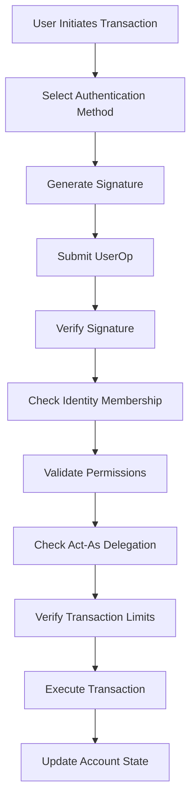

# Solana Account Abstraction (AA)

A comprehensive account abstraction implementation for Solana that enables smart accounts with multiple authentication methods, flexible permissions, and delegation capabilities.

## 🎯 Vision & Concept

This project aims to bring EIP-4337-style account abstraction to Solana, allowing users to:

- **Use any authentication method**: Ethereum wallets, WebAuthn/passkeys, OIDC providers, or custom schemes
- **Manage accounts flexibly**: Add/remove authentication methods without losing access
- **Delegate permissions**: Allow other identities to act on your behalf with granular controls
- **Recover accounts**: Multiple authentication paths prevent lockout scenarios
- **Interact cross-chain**: Ethereum signatures work natively, enabling cross-chain workflows

## 🏗 Architecture Overview

### Account Model

The system implements an **identity-based account abstraction model** where each abstract account can have multiple authentication identities with granular permissions.

```
┌─────────────────────────────────────┐
│           Abstract Account          │
├─────────────────────────────────────┤
│ • Account ID (unique)               │
│ • Nonce (replay protection)         │
│ • Multiple Identities:              │
│   ├─ Ethereum Wallet               │
│   ├─ WebAuthn Authenticator        │
│   ├─ OIDC Provider                 │
│   └─ Custom Authentication         │
│ • Permission Matrix                │
│ • Recovery Mechanisms              │
└─────────────────────────────────────┘
```

### Identity Types

#### 1. Ethereum Wallet Identity

Uses secp256k1 signatures compatible with Ethereum tooling:

```rust
Identity::Wallet(WalletType::Ethereum(address))
```

#### 2. WebAuthn Identity

Browser-based authentication using FIDO2/WebAuthn:

```rust
Identity::WebAuthn(WebAuthnAuthenticator {
    credential_id,
    public_key,
    authenticator_data
})
```

#### 3. OIDC Identity (Future)

OAuth-based authentication with RSA signatures:

```rust
Identity::OIDC(OIDCProvider {
    issuer,
    subject,
    public_key
})
```

### Permission System (Ideal)

Each identity can have fine-grained permissions:

```rust
pub struct IdentityPermissions {
    // Basic permissions
    can_transact: bool,           // Execute standard transactions
    can_add_identity: bool,       // Add new identities to account
    can_remove_identity: bool,    // Remove identities from account
    can_modify_permissions: bool, // Change permission levels
    can_delete_account: bool,     // Delete the entire account

    // Delegation permissions
    enable_act_as: bool,          // Can act on behalf of other identities
    act_as_targets: Vec<Identity>, // Specific identities this can act as

    // Advanced permissions
    spending_limits: Option<SpendingLimits>, // Transaction value limits
    time_restrictions: Option<TimeWindow>,   // Time-based access control
    action_whitelist: Option<Vec<Action>>,   // Allowed action types

    // Recovery permissions
    is_recovery_identity: bool,   // Can initiate account recovery
    recovery_delay: Option<u64>,  // Time delay for recovery actions
}
```

### Transaction Authorization Flow (Ideal)



## 🔐 Authentication Methods

### Ethereum Signature Authentication

**Status**: ✅ Implemented  
**Use Cases**: Cross-chain compatibility, existing Ethereum wallet integration

```typescript
// Sign transaction with Ethereum wallet
const signature = await wallet.signMessage(transactionData);
const userOp = {
  auth: { ethereum: { signature, address } },
  transaction: { account_id, nonce, action },
};
```

### WebAuthn Authentication

**Status**: 🚧 Partial (verification only)  
**Use Cases**: Passwordless authentication, mobile biometrics, hardware keys

```typescript
// Authenticate with WebAuthn
const credential = await navigator.credentials.create({
  publicKey: { challenge, ... }
});
const userOp = {
  auth: { webauthn: { credential, signature } },
  transaction: { account_id, nonce, action }
};
```

### OIDC Authentication

**Status**: 🔬 Experimental  
**Use Cases**: Social login, enterprise SSO, OAuth providers

```typescript
// Authenticate with OIDC provider
const jwt = await oidcProvider.getToken();
const userOp = {
  auth: { oidc: { jwt, signature } },
  transaction: { account_id, nonce, action },
};
```

## 🎭 Delegation & Act-As System (Ideal)

The system supports sophisticated delegation mechanisms:

### Simple Delegation

```rust
// Identity A acts as Identity B
UserOp {
  auth: Auth::Ethereum(identity_a_signature),
  act_as: Some(identity_b),
  transaction: Transaction { ... }
}
```

### Multi-Signature Scenarios

```rust
// Require multiple identities for high-value transactions
UserOp {
  auth: Auth::MultiSig(vec![
    identity_a_signature,
    identity_b_signature
  ]),
  transaction: Transaction { ... }
}
```

### Time-Limited Delegation

```rust
// Temporary delegation with expiration
IdentityPermissions {
  enable_act_as: true,
  act_as_targets: vec![identity_b],
  time_restrictions: Some(TimeWindow {
    start: now(),
    end: now() + 24_hours
  })
}
```

## 🔒 Security Model

### Layered Security Approach

1. **Cryptographic Verification**: All operations require valid signatures
2. **Identity-Based Access Control**: Fine-grained permissions per identity
3. **Delegation Validation**: Strict verification of act-as relationships
4. **Replay Protection**: Nonce-based transaction ordering
5. **Rate Limiting**: Spending limits and time-based restrictions
6. **Recovery Mechanisms**: Multiple paths to regain account access

### Account Recovery (Ideal)

```rust
// Recovery scenario: Lost primary device
pub struct RecoveryProcess {
  recovery_identities: Vec<Identity>,    // Backup authentication methods
  recovery_threshold: u8,                // Required signatures for recovery
  recovery_delay: Duration,              // Time delay before recovery
  social_recovery: Option<SocialRecovery>, // Trusted contacts
}
```

### Permission Inheritance (Ideal)

```rust
// Hierarchical permission model
pub enum PermissionLevel {
  Owner,      // Full control, can add/remove other identities
  Admin,      // Can modify permissions below admin level
  User,       // Can transact within limits
  Recovery,   // Can initiate recovery procedures only
  ReadOnly,   // Can view but not modify
}
```

## 🚧 Current Implementation Status

### ✅ Implemented Features

- [x] Abstract account creation and management
- [x] Ethereum signature verification and execution
- [x] Basic identity membership validation
- [x] Nonce-based replay protection
- [x] PDA-based account addressing
- [x] Account deletion and cleanup
- [x] Transaction buffer for large operations

### 🚧 Partially Implemented

- [ ] WebAuthn signature verification (verification only, no execution)
- [ ] Basic permission structure (defined but not enforced)
- [ ] RSA/OIDC verification (localnet only)

### ❌ Missing Critical Features

The following features are essential for production deployment:

## 📋 TODOs - Security & Permission System

### Critical Security Implementation (P0)

- [ ] **Permission Validation System**

  ```rust
  // TODO: Implement permission validation in transaction processing
  // Location: programs/solana-aa/src/contract/transaction/validation.rs:42-45
  // Missing: Complete permission checking logic
  ```

- [ ] **Act-As Delegation Validation**

  ```rust
  // TODO: Include verification for act_as functionality
  // Location: programs/solana-aa/src/contract/transaction/validation.rs:43
  // Missing: Delegation relationship verification
  ```

- [ ] **Remove Unauthorized Direct Methods**

  ```rust
  // TODO: Remove or secure direct account methods that bypass authentication
  // Location: programs/solana-aa/src/lib.rs:139-175
  // Issue: delete_account, add_identity, remove_identity bypass auth
  ```

- [ ] **Complete WebAuthn Execution Path**
  ```rust
  // TODO: Implement execute_webauthn function
  // Location: Create new execution path for WebAuthn transactions
  // Missing: Complete WebAuthn transaction execution
  ```

### Authentication Implementation (P1)

- [ ] **Multi-Signature Support**

  ```rust
  // TODO: Implement multi-signature transaction validation
  // Location: New module needed for multi-sig operations
  // Missing: Threshold-based authentication
  ```

- [ ] **RSA/OIDC Production Support**

  ```rust
  // TODO: Solve compute unit limitations for RSA verification
  // Location: programs/solana-aa/src/contract/auth/rsa/
  // Issue: Exceeds Solana compute limits on mainnet
  ```

- [ ] **Transaction Expiration**
  ```rust
  // TODO: Add timestamp-based transaction expiration
  // Location: programs/solana-aa/src/types/transaction/transaction.rs
  // Missing: Time-based transaction validity
  ```

### Permission System Implementation (P1)

- [ ] **Hierarchical Permission Model**

  ```rust
  // TODO: Implement owner/admin/user role hierarchy
  // Location: programs/solana-aa/src/types/identity/mod.rs
  // Missing: Role-based access control
  ```

- [ ] **Spending Limits**

  ```rust
  // TODO: Add transaction value and frequency limits
  // Location: New module for spending controls
  // Missing: Economic security controls
  ```

- [ ] **Time-Based Restrictions**
  ```rust
  // TODO: Implement time windows and session timeouts
  // Location: programs/solana-aa/src/types/identity/permissions.rs
  // Missing: Temporal access controls
  ```

### Recovery System Implementation (P2)

- [ ] **Social Recovery**

  ```rust
  // TODO: Implement trusted contact recovery mechanism
  // Location: New module for recovery operations
  // Missing: Social recovery system
  ```

- [ ] **Recovery Time Delays**

  ```rust
  // TODO: Add configurable delays for recovery operations
  // Location: Recovery module
  // Missing: Time-locked recovery procedures
  ```

- [ ] **Identity Recovery Procedures**
  ```rust
  // TODO: Implement lost identity replacement workflows
  // Location: Recovery module
  // Missing: Secure identity replacement
  ```

### Advanced Features (P2)

- [ ] **Batch Transactions**

  ```rust
  // TODO: Support multiple operations in single transaction
  // Location: New module for batch operations
  // Missing: Atomic multi-operation support
  ```

- [ ] **Session Keys**

  ```rust
  // TODO: Implement temporary keys for frequent operations
  // Location: New module for session management
  // Missing: Temporary delegation system
  ```

- [ ] **Gas Sponsorship/Paymaster**
  ```rust
  // TODO: Add fee delegation and sponsorship capabilities
  // Location: New module for fee management
  // Missing: Transaction fee abstraction
  ```

### Security Hardening (P1)

- [ ] **Input Validation**

  ```rust
  // TODO: Add comprehensive bounds checking for all inputs
  // Location: Throughout codebase
  // Missing: Robust input sanitization
  ```

- [ ] **Memory Safety**

  ```rust
  // TODO: Replace all unwrap() calls with proper error handling
  // Location: Multiple files with panic conditions
  // Issue: Potential denial of service attacks
  ```

- [ ] **Resource Limits**

  ```rust
  // TODO: Implement compute unit budgeting and memory limits
  // Location: Throughout execution paths
  // Missing: Resource exhaustion protection
  ```

- [ ] **Audit Logging**
  ```rust
  // TODO: Add comprehensive security event logging
  // Location: All security-critical operations
  // Missing: Security monitoring capabilities
  ```

## 🚀 Getting Started

### Prerequisites

- Rust 1.70+
- Solana CLI 1.16+
- Anchor Framework 0.31+
- Node.js 18+ (for tests)

### Installation

```bash
# Clone the repository
git clone https://github.com/your-org/solana-aa
cd solana-aa

# Install dependencies
npm install

# Build the program
anchor build

# Run tests
anchor test
```

### Creating an Abstract Account

```typescript
import { createAbstractAccount } from "./utils/solana";

// Create account with Ethereum wallet
const ethereumIdentity = {
  identity: {
    wallet: { ethereum: walletAddress },
  },
  permissions: {
    enable_act_as: false, // Basic permissions
  },
};

const accountId = await createAbstractAccount(ethereumIdentity);
```

### Adding Additional Identities

```typescript
// Add WebAuthn for passwordless auth
const webauthnIdentity = {
  identity: {
    webauthn: {
      credential_id: credentialId,
      public_key: publicKey,
    },
  },
  permissions: {
    enable_act_as: true, // Can act as other identities
    spending_limits: {
      daily_limit: 1000_000_000, // 1 SOL per day
    },
  },
};

await addIdentity(accountId, webauthnIdentity);
```

## 🧪 Testing

### Running the Test Suite

```bash
# Run all tests
npm test

# Run specific test categories
npm run test:auth        # Authentication tests
npm run test:permissions # Permission system tests
npm run test:recovery    # Recovery mechanism tests
npm run test:security    # Security vulnerability tests
```

### Test Coverage

Current test coverage focuses on:

- ✅ Ethereum signature authentication
- ✅ Basic account operations
- ✅ Nonce management
- ⚠️ Limited permission testing (incomplete implementation)
- ❌ Missing comprehensive security tests

## 🔍 Security Considerations

### Current Security Status

**⚠️ WARNING: This implementation is NOT production-ready**

Critical security issues that must be resolved:

1. **Missing Permission Validation**: Any identity can perform privileged operations
2. **Incomplete Authentication**: Only Ethereum signatures are functional
3. **No Recovery Mechanisms**: No way to recover from compromised or lost identities
4. **Memory Safety Issues**: Multiple panic conditions in core logic
5. **Resource Exhaustion**: No protection against expensive operations

### Security Roadmap

See `security.md` for detailed vulnerability analysis and remediation plan.

### Recommended Security Practices

1. **Multi-Factor Setup**: Always configure multiple authentication methods
2. **Permission Minimization**: Grant least privileges necessary
3. **Regular Audits**: Monitor account activity and permission changes
4. **Recovery Planning**: Establish recovery procedures before they're needed
5. **Spending Limits**: Configure appropriate transaction limits

## 🛣 Roadmap

### Phase 1: Security Foundation (Q3 2024)

- [ ] Complete permission validation system
- [ ] Implement all authentication methods
- [ ] Add comprehensive error handling
- [ ] Security audit and penetration testing

### Phase 2: Advanced Features (Q4 2024)

- [ ] Multi-signature support
- [ ] Social recovery mechanisms
- [ ] Session key management
- [ ] Cross-chain integration

### Phase 3: Ecosystem Integration (Q1 2025)

- [ ] Wallet integration (Phantom, Solflare)
- [ ] DApp SDK and tooling
- [ ] Gas sponsorship/paymaster
- [ ] Advanced delegation patterns

### Phase 4: Enterprise Features (Q2 2025)

- [ ] Enterprise SSO integration
- [ ] Compliance and auditing tools
- [ ] Advanced recovery workflows
- [ ] Custom authentication plugins

## 🤝 Contributing

We welcome contributions! Please see our [Contributing Guide](CONTRIBUTING.md) for details.

### Development Priorities

1. **Security First**: All contributions must prioritize security
2. **Test Coverage**: New features require comprehensive tests
3. **Documentation**: Code must be well-documented
4. **Compatibility**: Maintain backwards compatibility where possible

### Reporting Security Issues

Please report security vulnerabilities to security@yourorg.com. Do not create public issues for security problems.

## 📚 Documentation

- [Architecture Overview](docs/architecture.md)
- [Authentication Guide](docs/authentication.md)
- [Permission System](docs/permissions.md)
- [Security Analysis](security.md)
- [API Reference](docs/api.md)

## 📄 License

This project is licensed under the MIT License - see the [LICENSE](LICENSE) file for details.

## 🙏 Acknowledgments

- Solana Foundation for the excellent development environment
- EIP-4337 authors for account abstraction inspiration
- Anchor Framework team for the development tools
- Security researchers who contributed to the analysis

---

**⚠️ Disclaimer**: This software is experimental and not ready for production use. Use at your own risk and always conduct thorough security audits before deploying to mainnet.
